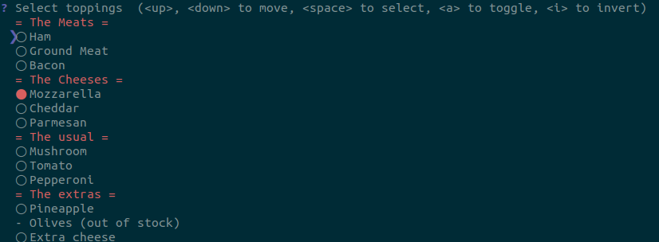
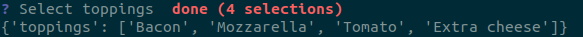

# cogitate_tool

## Development Doc

After pulling the repo, use `pipenv shell` in `cogitate_tool/` to enter the virtual
environment. Use `exit` to exit. Under the virtual environment, use
`pipenv install <package_name> --dev` to install new packages.

### 1. File Structure

```bash
.
├── Pipfile
├── Pipfile.lock
├── README.md
├── scripts
│   └── cogitate.sh
├── src
│   ├── cogitate_tool.py
│   ├── data_collection.py
│   ├── demo.py
│   └── driller.py
└── tests
    └── test_cogitate_tool.py
```

### 2. CLI

The [homepage](https://github.com/CITGuru/PyInquirer) for `PyInquirer`. And a
[helpful site](https://codeburst.io/building-beautiful-command-line-interfaces-with-python-26c7e1bb54df).

The available attributes can be found at their homepage.

#### 2.1 Hello World

Basic example:

```python
from __future__ import print_function, unicode_literals
from PyInquirer import prompt
"""pprint print data structures in a beautiful way"""
from pprint import pprint

"""The question for users"""
questions = [
    {
        'type': 'input',
        'name': 'first_name',
        'message': 'What\'s your first name',
     }
]

"""Create objects for answers"""
answers = prompt(questions)
"""print the answer we got, the dictionary look data can be used for future use"""
pprint(answers)
```

**Output:**

```bash
pipenv run python hello.py
? What's your first name  Sheldon
{'first_name': 'Sheldon'}
```

#### 2.2 Interactive

```python
from __future__ import print_function, unicode_literals
from PyInquirer import style_from_dict, Token, prompt, Separator
from pprint import pprint

"""Style for pretty interface"""
style = style_from_dict({
    Token.Separator: '#cc5454',
    Token.QuestionMark: '#673ab7 bold',
    Token.Selected: '#cc5454',  # default
    Token.Pointer: '#673ab7 bold',
    Token.Instruction: '',  # default
    Token.Answer: '#f44336 bold',
    Token.Question: '',
})

"""question set up"""
questions = [
    {
        'type': 'checkbox',
        'message': 'Select toppings',
        'name': 'toppings',
        'choices': [
            Separator('= The Meats ='),
            {
                'name': 'Ham'
            },
            {
                'name': 'Ground Meat'
            },
            {
                'name': 'Bacon'
            },
            Separator('= The Cheeses ='),
            {
                'name': 'Mozzarella',
                'checked': True
            },
            {
                'name': 'Cheddar'
            },
            {
                'name': 'Parmesan'
            },
            Separator('= The usual ='),
            {
                'name': 'Mushroom'
            },
            {
                'name': 'Tomato'
            },
            {
                'name': 'Pepperoni'
            },
            Separator('= The extras ='),
            {
                'name': 'Pineapple'
            },
            {
                'name': 'Olives',
                'disabled': 'out of stock'
            },
            {
                'name': 'Extra cheese'
            }
        ],
        'validate': lambda answer: 'You must choose at least one topping.' \
            if len(answer) == 0 else True
    }
]

answers = prompt(questions, style=style)
pprint(answers)
```

**Outputs:**





#### 2.3 Summary

Let's see the data type of answer:

If we run `type(answers)`, we get `<class 'dict'>`.

So, one possible approach is that we provide possible options for user to choose.
And we use the dictionary for later access. If we do end up need to get user
password, we can hash it first, then use the match method.


### 3. PyDriller

The [homepage](https://github.com/ishepard/pydriller) and [documentation](https://pydriller.readthedocs.io/en/latest/intro.html) for `PyDriller`.

The available attributes can be found at their homepage.
